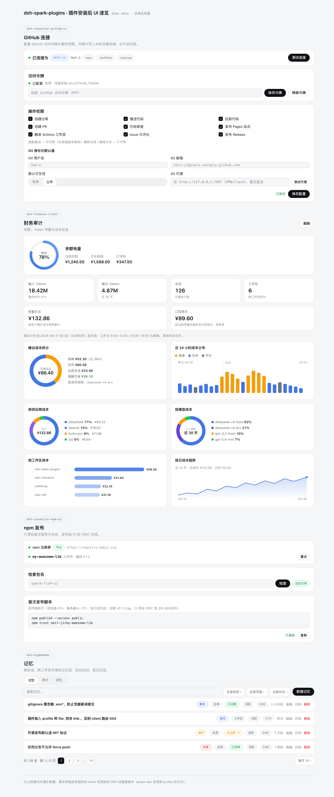

# dsh-spark-plugins

DSH 第三方插件 monorepo（pnpm workspace）：UI/UX 与 DSH Web 官方设计系统逐像素对齐，版本兼容经两道闸体检。落地页：<https://neil-ji.github.io/dsh-spark-plugins/>

## 安装

前置：dsh `0.1.1-rc.2`（其他版本先看[版本兼容](https://neil-ji.github.io/dsh-spark-plugins/#compat)）、Node.js ≥ 18 与 git（pnpm 自动引导）。

```bash
curl -fsSL https://neil-ji.github.io/dsh-spark-plugins/install.sh | sh
```

脚本幂等：重复执行 = 更新到最新。源码会被固定克隆到 `~/.dsh/spark-plugins`。

```bash
# 常用变体（先 curl -o install.sh 下载后执行）
sh install.sh --profile main      # 指定目标 dsh profile（默认 web）
sh install.sh --ref v0.2.0        # 锁定 tag / 分支
sh install.sh --no-profile        # 只更新源码，不重链 profile
```

装完重启 dsh web，到设置页完成各插件的连接配置即可。卸载：`dsh plugin remove <插件名>` 并删除 `~/.dsh/spark-plugins`。发布 npm 版本视需求后续提供。

## 安装后 UI 速览



<p align="center">GitHub 连接器 · 财务审计 · npm 发布管线 · 记忆（HippoMemo）——按 DSH 设计系统 1:1 复刻的静态预览，演示数据见 <a href="docs/demo.html">docs/demo.html</a></p>

## 包一览（12 个包）

| 包 | 目录 | 说明 |
| --- | --- | --- |
| dsh-hippomemo | packages/dsh-hippomemo | 跨会话/跨工作区共享记忆插件 |
| dsh-spark-plugin-kit | packages/dsh-plugin-kit | 公共层：client 设置页样板（settings.section / locale / CSS 注入） |
| dsh-ui-kit | packages/dsh-ui-kit | 本地 React 组件库（复刻 DSH 设计系统，零 cordis） |
| dsh-spark-finance | packages/dsh-finance | 成本统计插件 host（remote/typert + 计算核心） |
| dsh-spark-finance-client | packages/dsh-finance-client | 成本统计插件 client（设置页 UI） |
| dsh-spark-finance-bundle | packages/dsh-finance-bundle | 成本统计插件安装入口（cordis.patch） |
| dsh-connector-github | packages/dsh-github | GitHub 连接器 host（40+ 工具） |
| dsh-connector-github-ui | packages/dsh-github-ui | GitHub 连接器 client（连接配置页） |
| dsh-connector-wire | packages/dsh-github-wire | GitHub 连接器 wire（remote 协议定义） |
| dsh-connector-npm | packages/dsh-npm | npm 发布管线 host（7 工具） |
| dsh-connector-npm-ui | packages/dsh-npm-ui | npm 发布管线 client（发布状态页） |
| dsh-connector-npm-wire | packages/dsh-npm-wire | npm 管线 wire（remote 协议定义） |

> 目录名沿用各自源码仓库的目录名（dsh-github / dsh-npm / dsh-finance），npm 包名以各包 package.json 为准；`dsh-plugin-kit` / `dsh-finance` 在 npm 被占用，故发布为 `dsh-spark-plugin-kit` / `dsh-spark-finance`。

## dsh 升级体检（常态化追踪破坏性改动）

- `pnpm check:dsh-upgrade` — 快检：npm 发布产物 API 面 diff + 插件 import 符号/事件存活检查，报告归档 `docs/dsh-upgrade-reports/`
- `pnpm dryrun:dsh-upgrade` — 真验：临时目录钉新版本 + 干净安装 + `pnpm -r typecheck`
- 完整流程与调度见 [docs/UPGRADE-PROTOCOL.md](docs/UPGRADE-PROTOCOL.md)

## 常用命令

```bash
pnpm build        # 构建全部包（各包产出 lib/ 或 dist/）
pnpm typecheck    # 类型检查全部包
pnpm test         # 测试全部包（含根 vitest，共 255 用例）
pnpm dev          # 构建全部 + 安装到 web profile
pnpm dev --run    # 构建 + 安装 + 前台启动 dogfood（dsh --profile web --port 3999）
pnpm install:profile  # 仅重新安装到 profile（依赖 file: 链接）
pnpm escape       # 启动「应急逃生」profile（纯官方 web，端口 3998）
pnpm escape:init  # 仅初始化/刷新逃生 profile（幂等）
pnpm finance:sync-prices  # 从 models.dev 社区价格表同步非 DeepSeek 计价进 bundle（--dry-run 预览、--fx 调汇率）
```

## 本地运行机制

1. `pnpm dev` 先构建所有包（DSH 加载的是 `lib/` 产物）。
2. `scripts/install-profile.mjs` 按 `plugin-registry.json` 的映射，把各插件以 `file:` 依赖写入
   `~/.dsh/profiles/web/package.json`，并把本 monorepo 的 `packages/*` 挂载进 profile 的
   `pnpm-workspace.yaml`（workspace:` 依赖因此解析到本地源码），最后在 profile 目录 `pnpm install`。
3. `dsh --profile web --port 3999` 启动 dogfood 验证。

> 注意：`3080` 是常驻工作服务，验证一律走 `3999`，不要动 3080。

## 应急逃生入口（纯官方 profile）

插件栈或 web profile 出问题（版本漂移、加载失败、误改配置）导致 3080 起不来时，
用逃生 profile 先救回一个可用的 dsh GUI——**只加载官方 bundles**（`@deepseek-ai/dsh-base`
+ `@deepseek-ai/dsh-web-app`），零第三方插件、零 monorepo 依赖，跟随全局 dsh 版本，
不依赖本仓库的任何东西：

```bash
pnpm escape        # = 初始化（幂等）+ 启动 dsh --profile escape --port 3998
pnpm escape:init   # 只初始化/刷新，不启动；之后手动 dsh --profile escape --port <port>
```

- 会话/存储与 web profile 共用 `DSH_HOME`，数据不变，只是不加载第三方插件。
- 逃生 profile 目录：`~/.dsh/profiles/escape`（用官方 `initProfile` + web 模板创建，
  含 `cordis.patch.yml` 空补丁层；已有文件不会被覆盖）。
- 初始化脚本：`scripts/escape-profile.mjs`（从全局 dsh 安装解析 `dsh-app-boot` API）。
- 应急三板斧：先 `pnpm escape` 拿到干净 GUI → 再排查 `pnpm install:profile` 刷新 web profile
  → 最后重启/验证 3080。

## 依赖版本策略

- 所有 `@deepseek-ai/*` 通过 `pnpm-workspace.yaml` 的 `overrides` 强制为 `0.1.1-rc.2`
  （与全局 dsh 内部依赖版本一致；npm latest 仍是残缺的 rc.1 系列，必须逐包精确钉版，
  避免多实例类型分裂与运行时加载失败）。
- 插件包之间用 `workspace:*` 依赖，构建时内联或按需解析。

## 新增一个插件

1. `packages/<name>` 下建包（host 出 `lib/index.js`，client 出 `lib/client.js`，参考 dsh-hippomemo）。
2. 需要 client UI 时引用 `dsh-spark-plugin-kit` 的 `registerSettingsSection`。
3. 在 `plugin-registry.json` 登记，`pnpm dev` 后即可在 3999 验证。
## License

[MIT](./LICENSE)
